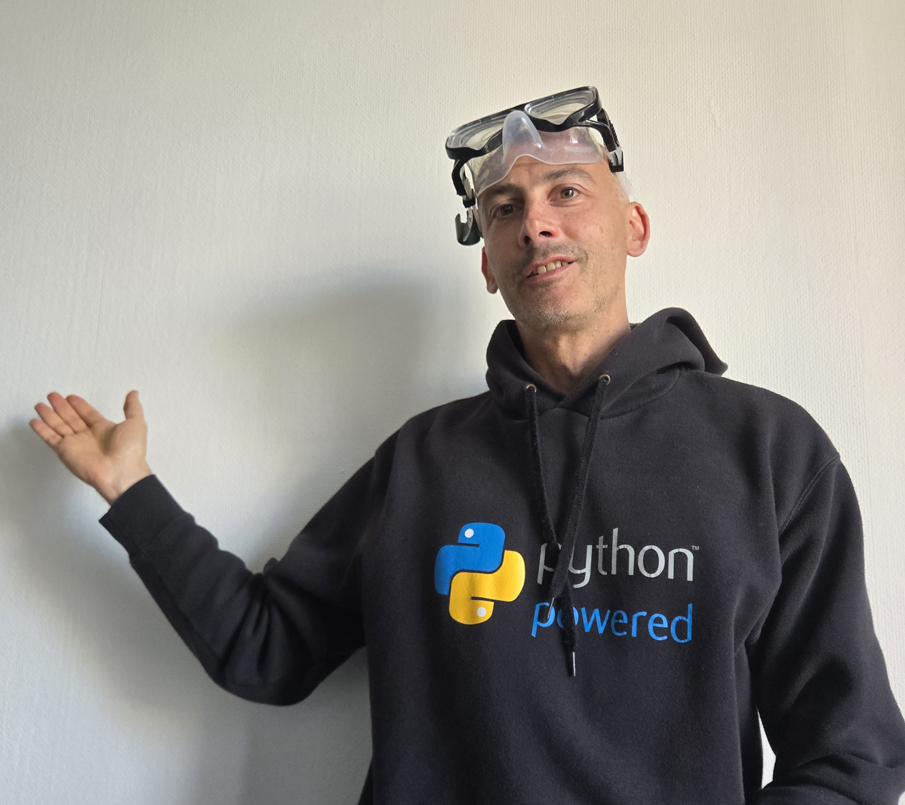

# Get AI to do the boring workfor you

### I have 5+ years experience providing AI/ML solutions to client needs

- Want to implement AI effectively before competitors get ahead?

- Looking for technical expertise and a clear roadmap for AI solutions?

- Need someone who understands both technical and business perspectives?

[Book Free Intro Call :material-arrow-top-right:](https://www.calendly.com){ .md-button .md-button--primary }

{ .profile-image alt="Portrait of Marco Berta, AI entrepreneur and content creator" }

## About me

Hi! I'm Marco Berta, an AI Engineer with 5+ years of experience designing and delivering AI/ML solutions across diverse industries and with a variety of partners. I help businesses and technical teams move beyond the noise of AI hype and focus on building systems that create real competitive advantage. Whether it’s an engineering team navigating rapid shifts in AI technology or a company unsure how to leverage it effectively—the challenge is the same: turning AI into practical, scalable impact before competitors do.

My background includes hands-on experience developing custom AI-driven systems for utilities, government, and e-commerce, as well as cross-industry collaborations. My tech stack spans Python, PostgreSQL, machine learning, FastAPI, OpenAI, Claude, Azure, vector databases, RAG implementations, and large language model integrations tailored for enterprise applications.

-   :material-coffee:{ .lg .middle } Let's have a virtual coffee together!

    ---
    
    Want to see if we're a match? Let's have a chat and find out. Schedule a free 30-minute strategy session to discuss your AI challenges and explore how we can work together.

    [Book Free Intro Call :material-arrow-top-right:](https://calendly.com){ .md-button .md-button--primary }

