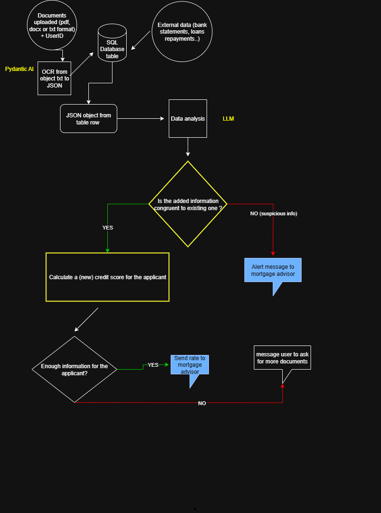

---
# AI-Powered Mortgage Analysis System

## Project Overview

The AI-Powered Mortgage Analysis System is a comprehensive solution designed to revolutionize mortgage document processing and income verification. This system leverages advanced artificial intelligence technologies including Optical Character Recognition (OCR), Natural Language Processing (NLP), and machine learning algorithms to automate the traditionally manual and time-intensive mortgage application review process.

## Key Features

- **Intelligent Document Upload**: Secure upload interface for various mortgage-related documents (pay stubs, tax returns, bank statements, etc.)
- **Advanced OCR Processing**: Extracts text and data from scanned documents and images with high accuracy
- **Income Verification Logic**: Automated analysis and verification of applicant income sources and stability
- **Document Classification**: Automatically identifies and categorizes different document types
- **Data Validation**: Cross-references extracted information for consistency and accuracy
- **Compliance Monitoring**: Ensures adherence to mortgage industry regulations and standards
- **Risk Assessment**: Provides automated risk scoring based on extracted financial data

## Summary of Core Process:

Borrower uploads documents (scanned images, PDFs).

AI classifies and OCR-processes documents, extracts structured data.

Extracted data is cross-checked for completeness, compliance, and validated against external sources.

Any discrepancies are flagged; compliant applications proceed without delay.

Audit-ready reports are generated and delivered securely to decision-makers.

## Diagram

## Key Capabilities:

Document Classification: Instantly sorts and files over 100 document types (e.g., pay stubs, bank statements, leases).

Data Extraction & Validation: Extracts critical figures—gross/net income, employment history, deductions—from scanned PDFs or even blurry images, and matches them against bank records.

Automated Compliance: Checks applicant data against regulatory standards (Fannie Mae, Freddie Mac, FHA, etc.) and auto-redacts sensitive info.

Decision-making & Routing: Flags incomplete or exception files for human intervention, while compliant documents move directly to underwriting without manual review.

## Sources of Input Data:

Pay stubs

Tax returns

W-2 and 1099 forms

Bank statements

Loan packages (often as scanned images or PDFs)

Employment verification data (e.g., LinkedIn, employer databases)

## Return on Investment (ROI) & Impact:

Productivity: Cuts document processing time from days to minutes—what used to require a team of 20 can now be done by one operator. Average time from loan approval to closing is reduced by up to 47%.

Reduced Costs: AI workflow automation can lower operational costs by 20–50%, with some platforms reporting a 29% cost reduction and 72% increase in workflow automation.

Compliance Gains: Near-zero manual entry errors and consistent adherence to industry standards enhance audit readiness and reduce regulatory risk.

Increased Revenue & Volume: Fast processing allows handling of higher loan volumes and quicker onboarding of business partners (weeks to days).

Quality: Document data extraction accuracy and fraud detection are significantly improved, and more borrowers are qualified through deeper risk modeling.

## Typical KPI Outcomes:

Up to 75% reduction in income verification processing time.

31% reduction in default rates with AI-enhanced underwriting.

20–50% lower costs due to automation.

Enabled scaling for more loans without extra staff.

## Technology Stack

- **Backend**: Python with Flask/Django framework
- **OCR Engine**: Integration points for Tesseract, AWS Textract, or Google Cloud Vision API
- **NLP Processing**: spaCy, NLTK, or custom machine learning models
- **Database**: PostgreSQL or Supabase for document storage and metadata
- **Security**: End-to-end encryption for sensitive financial data

-   :material-coffee:{ .lg .middle } Let's have a virtual coffee together!

    ---
    
    Want to see if we're a match? Let's have a chat and find out. Schedule a free 30-minute strategy session to discuss your AI challenges and explore how we can work together.

    [Book Free Intro Call :material-arrow-top-right:](https://calendly.com){ .md-button .md-button--primary }

